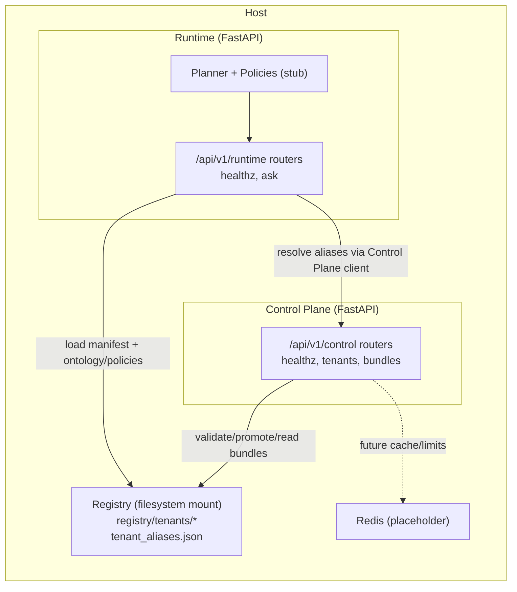

## Contêineres (C4 - Nível 2)

O Stage 0 utiliza dois serviços FastAPI (Control Plane e Runtime) compartilhando o mesmo código-base e montando o **Registry** local. O `docker-compose.yml` também define um contêiner Redis apenas como reserva futura (não utilizado pelo código atual).

### Control Plane (FastAPI)
- **Responsabilidades**: health check, validação de manifest (`/tenants/{tenant_id}/bundles/{bundle_id}/validate`), gestão de aliases (`draft`, `candidate`, `current`).
- **Persistência**: filesystem (`registry/tenants` + `registry/control_plane/tenant_aliases.json`), sem banco de dados.
- **Configuração**: `BUNDLE_REGISTRY_BASE`, `CONTROL_ALIAS_STORE_PATH`, `CONTROL_HOST`, `CONTROL_PORT`.

### Runtime (FastAPI)
- **Responsabilidades**: endpoint `/ask` determinístico, resolução de aliases via client do Control Plane, carregamento de manifest e políticas/ontologia, retorno de decisão estável (planner stub ativo).
- **Configuração**: `CONTROL_BASE_URL`, `BUNDLE_REGISTRY_BASE`, `RUNTIME_HOST`, `RUNTIME_PORT`.

### Registry (Filesystem)
- Estrutura sob `registry/tenants/<tenant_id>/bundles/<bundle_id>/`.
- Manifest contém caminhos relativos para `ontology/`, `entities/`, `policies/`, `templates/`, `suites/`.
- Arquivo `registry/control_plane/tenant_aliases.json` mantém aliases por tenant.

### Redis (placeholder)
- Definido no `docker-compose.yml` para alinhar com ADR-0008/0013; ainda não consumido pela aplicação.
