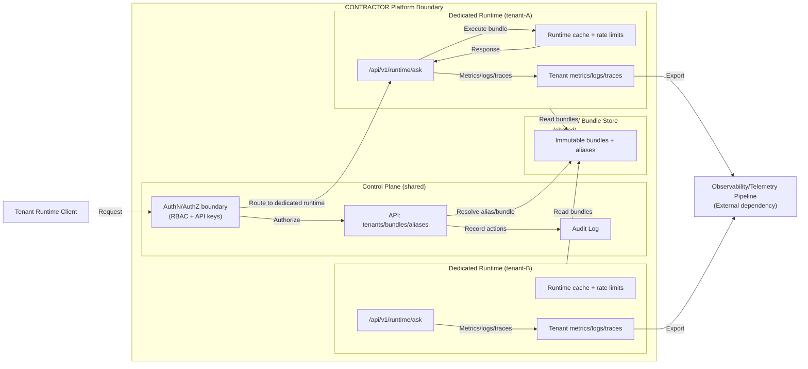

# C4 — Container View (Stage 3)

## Overview

Esta visão descreve os principais contêineres lógicos do CONTRACTOR no Stage 3 (Enterprise Ready). O foco é **runtime dedicado por tenant**, controle de acesso explícito, observabilidade segregada e limites de SLA. Todo item marcado como **Stage 3 target** representa objetivo do roadmap. [ADR 0021](../../ADR/0021-product-roadmap-and-maturity-stages.md)

## Containers (logical)

## Flow (Stage 3 target)

1. **Request** chega com identidade escopada por tenant. [ADR 0027](../../ADR/0027-enterprise-access-control-and-identity-boundaries.md)
2. **AuthN/AuthZ** valida credenciais e papel (RBAC). [ADR 0027](../../ADR/0027-enterprise-access-control-and-identity-boundaries.md)
3. **Control Plane** resolve alias/bundle e aplica governança. [ADR 0022](../../ADR/0022-dedicated-runtime-and-isolation-model.md)
4. **Routing** direciona para o runtime dedicado do tenant (sem fallback). [ADR 0022](../../ADR/0022-dedicated-runtime-and-isolation-model.md)
5. **Runtime execution** aplica cache, rate limits e execução isolada. [ADR 0022](../../ADR/0022-dedicated-runtime-and-isolation-model.md)
6. **Telemetry** gera métricas e logs agregados por tenant. [ADR 0024](../../ADR/0024-tenant-level-observability.md)
7. **Response** retorna ao cliente; SLA considera apenas o runtime dedicado. [ADR 0023](../../ADR/0023-enterprise-sla-model.md)

## Stage 2 → Stage 3 Delta

* **Runtime**: de pool compartilhado para **dedicado por tenant**, sem multi-tenancy oculto. [ADR 0022](../../ADR/0022-dedicated-runtime-and-isolation-model.md)
* **SLA**: de SLO interno para **SLA contratual** limitado ao runtime dedicado. [ADR 0023](../../ADR/0023-enterprise-sla-model.md)
* **Observability**: de métricas globais para **métricas/logs segregados por tenant**. [ADR 0024](../../ADR/0024-tenant-level-observability.md)
* **Incident response**: de operação interna para **modelo formal de incidentes e escalonamento**. [ADR 0025](../../ADR/0025-enterprise-incident-and-escalation-model.md)
* **Compliance**: de políticas gerais para **boundaries explícitas de residência e retenção**. [ADR 0026](../../ADR/0026-enterprise-data-residency-and-compliance-boundaries.md)
* **Access control**: de API keys simples para **RBAC limitado e auditável**. [ADR 0027](../../ADR/0027-enterprise-access-control-and-identity-boundaries.md)

## External Dependencies

* **Observability stack** (ex.: Prometheus/Grafana) é integração externa; não há prescrição de stack específica. [ADR 0024](../../ADR/0024-tenant-level-observability.md)
* **Registry/Bundle Store** permanece centralizado e compartilhado; o runtime dedicado não altera o contrato de API. [ADR 0022](../../ADR/0022-dedicated-runtime-and-isolation-model.md)

## ADR References

* [ADR 0021 — Product Roadmap and Maturity Stages](../../ADR/0021-product-roadmap-and-maturity-stages.md)
* [ADR 0022 — Dedicated Runtime & Isolation Model](../../ADR/0022-dedicated-runtime-and-isolation-model.md)
* [ADR 0023 — Enterprise SLA Model](../../ADR/0023-enterprise-sla-model.md)
* [ADR 0024 — Tenant-Level Observability](../../ADR/0024-tenant-level-observability.md)
* [ADR 0025 — Enterprise Incident & Escalation Model](../../ADR/0025-enterprise-incident-and-escalation-model.md)
* [ADR 0026 — Enterprise Data Residency & Compliance Boundaries](../../ADR/0026-enterprise-data-residency-and-compliance-boundaries.md)
* [ADR 0027 — Enterprise Access Control & Identity Boundaries](../../ADR/0027-enterprise-access-control-and-identity-boundaries.md)
* [ADR 0028 — Stage 3 Completion & Readiness Checklist](../../ADR/0028-stage-3-completion-and-readiness-checklist.md)
