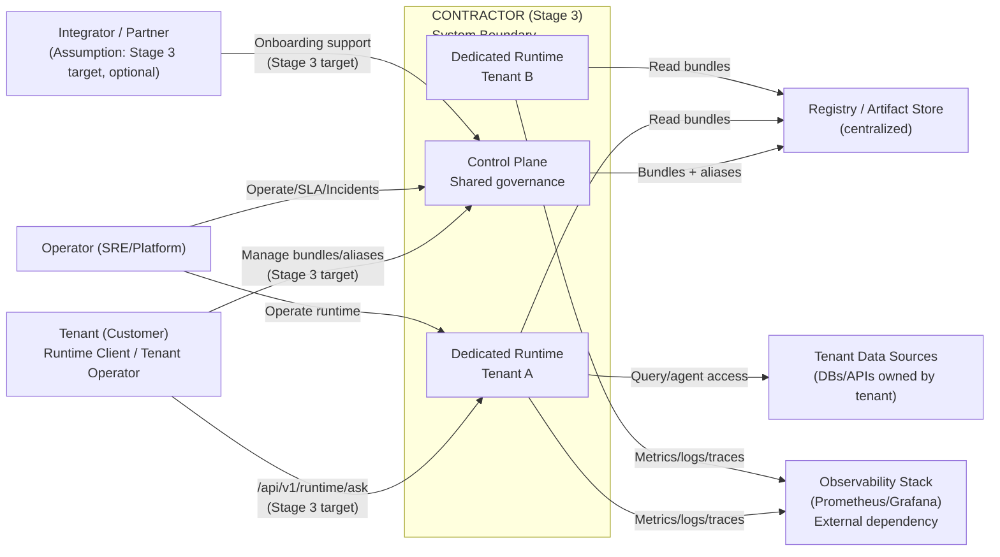

# C4 — System Context (Stage 3)

## Scope

Este documento descreve o contexto do sistema CONTRACTOR no **Stage 3 (Enterprise Ready)**. O foco é isolamento por tenant, observabilidade segregada e boundaries enterprise. Capacidades descritas como **Stage 3 target** representam o objetivo do roadmap, não garantia de implementação atual. [ADR 0021](../../ADR/0021-product-roadmap-and-maturity-stages.md)

## System Context (textual diagram)

## Data / Trust Boundaries

* **Tenant-controlled**: dados de domínio do cliente e suas fontes externas (DBs/APIs). O CONTRACTOR processa dados de domínio de forma transitória e não assume residência para dados não persistidos. [ADR 0026](../../ADR/0026-enterprise-data-residency-and-compliance-boundaries.md)
* **Platform-controlled**: Control Plane, Registry/Artifact Store, runtimes dedicados, telemetria agregada e audit logs. Esses dados têm políticas de retenção e residência configuráveis por tenant (Stage 3 target). [ADR 0024](../../ADR/0024-tenant-level-observability.md) [ADR 0026](../../ADR/0026-enterprise-data-residency-and-compliance-boundaries.md)
* **Identity boundary**: identidades são sempre escopadas por tenant; não existe credencial global multi-tenant. [ADR 0027](../../ADR/0027-enterprise-access-control-and-identity-boundaries.md)
* **SLA boundary**: SLA cobre apenas o runtime dedicado e métricas agregadas por tenant. Control Plane fora do SLA Stage 3. [ADR 0023](../../ADR/0023-enterprise-sla-model.md)

## External Actors and Systems

* **Tenant (Customer)**: consome o runtime dedicado e opera seus próprios dados de domínio. [ADR 0022](../../ADR/0022-dedicated-runtime-and-isolation-model.md)
* **Operator (SRE/Platform)**: opera o runtime dedicado e executa o modelo de incidentes e escalonamento. [ADR 0025](../../ADR/0025-enterprise-incident-and-escalation-model.md)
* **Integrator/Partner**: **Assumption (Stage 3)**. Figura opcional para onboarding enterprise; não existe compromisso formal no Stage 3. Referência de roadmap. [ADR 0021](../../ADR/0021-product-roadmap-and-maturity-stages.md)
* **Observability Stack**: dependência externa para métricas/relatórios por tenant. Instrumentação no runtime dedicado (Stage 3 target). [ADR 0024](../../ADR/0024-tenant-level-observability.md)
* **Registry/Artifact Store**: armazenamento centralizado de bundles e aliases; compartilhado entre tenants, sem execução multi-tenant no runtime. [ADR 0022](../../ADR/0022-dedicated-runtime-and-isolation-model.md)

## ADR References

* [ADR 0021 — Product Roadmap and Maturity Stages](../../ADR/0021-product-roadmap-and-maturity-stages.md)
* [ADR 0022 — Dedicated Runtime & Isolation Model](../../ADR/0022-dedicated-runtime-and-isolation-model.md)
* [ADR 0023 — Enterprise SLA Model](../../ADR/0023-enterprise-sla-model.md)
* [ADR 0024 — Tenant-Level Observability](../../ADR/0024-tenant-level-observability.md)
* [ADR 0025 — Enterprise Incident & Escalation Model](../../ADR/0025-enterprise-incident-and-escalation-model.md)
* [ADR 0026 — Enterprise Data Residency & Compliance Boundaries](../../ADR/0026-enterprise-data-residency-and-compliance-boundaries.md)
* [ADR 0027 — Enterprise Access Control & Identity Boundaries](../../ADR/0027-enterprise-access-control-and-identity-boundaries.md)
* [ADR 0028 — Stage 3 Completion & Readiness Checklist](../../ADR/0028-stage-3-completion-and-readiness-checklist.md)
