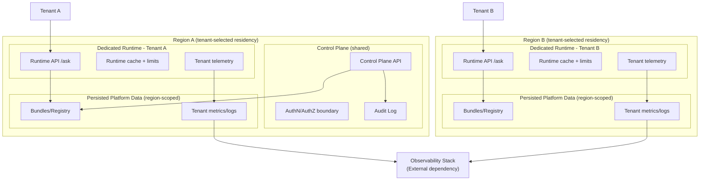

# C4 — Deployment View (Stage 3)

## Overview

Este documento descreve uma opção mínima viável de deployment para **Stage 3 (Enterprise Ready)**. O objetivo é explicitar isolamento por tenant, boundaries por região e observabilidade segregada, sem prescrever tecnologia específica. Itens com **Stage 3 target** são objetivos do roadmap. [ADR 0021](../../ADR/0021-product-roadmap-and-maturity-stages.md)

## Deployment (logical)

## Deployment Notes (Stage 3 target)

* **Control Plane compartilhado**: permanece compartilhado, fora do escopo de SLA. [ADR 0022](../../ADR/0022-dedicated-runtime-and-isolation-model.md) [ADR 0023](../../ADR/0023-enterprise-sla-model.md)
* **Runtime dedicado por tenant**: runtime isolado com routing explícito; sem fallback para runtime compartilhado. [ADR 0022](../../ADR/0022-dedicated-runtime-and-isolation-model.md)
* **Residência por região**: dados persistidos (bundles, métricas, logs, audit) residem na região escolhida pelo tenant. [ADR 0026](../../ADR/0026-enterprise-data-residency-and-compliance-boundaries.md)
* **Observabilidade por tenant**: métricas/logs segregados e exportados para pipeline externo. [ADR 0024](../../ADR/0024-tenant-level-observability.md)
* **AuthN/AuthZ**: RBAC limitado, identidades segregadas por tenant. [ADR 0027](../../ADR/0027-enterprise-access-control-and-identity-boundaries.md)

## Operational Notes (Stage 3)

* **Isolamento e blast radius**: falhas em um runtime dedicado não afetam outros tenants nem o runtime compartilhado. [ADR 0022](../../ADR/0022-dedicated-runtime-and-isolation-model.md)
* **Logging/retention boundaries**: logs e métricas seguem retenção configurável por tenant e políticas de privacidade/retention. [ADR 0018](../../ADR/0018-data-privacy-lgpd-gdpr-and-retention-policies.md) [PRIVACY](../../PRIVACY)
* **Incident/escalation hooks**: incidentes enterprise seguem severidade, comunicação e postmortem definidos; integração com SLA. [ADR 0025](../../ADR/0025-enterprise-incident-and-escalation-model.md) [ADR 0023](../../ADR/0023-enterprise-sla-model.md)

## Assumptions (Stage 3)

* **Control Plane multi-região**: não especificado. Assume-se presença mínima por região para suportar residência e governança sem prometer active-active. [ADR 0026](../../ADR/0026-enterprise-data-residency-and-compliance-boundaries.md)
* **Observability stack**: dependência externa; integração é requisito, tecnologia é agnóstica. [ADR 0024](../../ADR/0024-tenant-level-observability.md)

## ADR References

* [ADR 0021 — Product Roadmap and Maturity Stages](../../ADR/0021-product-roadmap-and-maturity-stages.md)
* [ADR 0022 — Dedicated Runtime & Isolation Model](../../ADR/0022-dedicated-runtime-and-isolation-model.md)
* [ADR 0023 — Enterprise SLA Model](../../ADR/0023-enterprise-sla-model.md)
* [ADR 0024 — Tenant-Level Observability](../../ADR/0024-tenant-level-observability.md)
* [ADR 0025 — Enterprise Incident & Escalation Model](../../ADR/0025-enterprise-incident-and-escalation-model.md)
* [ADR 0026 — Enterprise Data Residency & Compliance Boundaries](../../ADR/0026-enterprise-data-residency-and-compliance-boundaries.md)
* [ADR 0027 — Enterprise Access Control & Identity Boundaries](../../ADR/0027-enterprise-access-control-and-identity-boundaries.md)
* [ADR 0028 — Stage 3 Completion & Readiness Checklist](../../ADR/0028-stage-3-completion-and-readiness-checklist.md)
